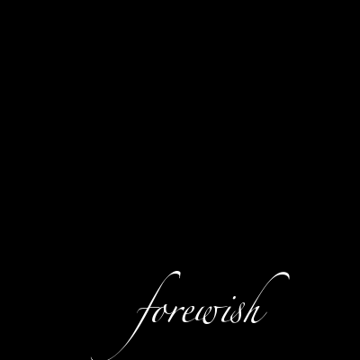
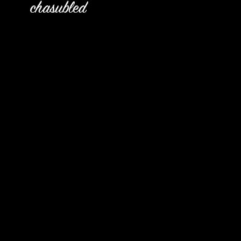
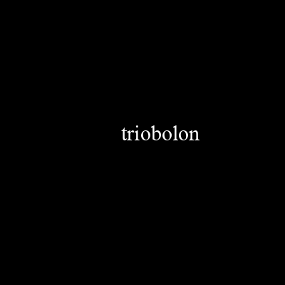

# Text-In-Image Dataset

This dataset provides a simple baseline for text within the image space with binary colors. The dataset is generated programmatically with the image manipulation library `PIL`. The goal is to generate text inside images
with two varying factors:

- Position of the text
- Style of the text

In addition to the the style and position is captured in an associated caption/label for each image. Ideally these captions will help models learn the keywords and map features such as position and style to an output text
within an image.

As of right now positions are limited to the following:

- Top Left
- Top Right
- Bottom
- Center

Styles are limited to the following:

- Serif
- San Serif
- Cursive
- Hand Painted

Words are sourced using the `english-words` package. By default position and areas are decided at random to promote diversity in the dataset.

## Usage

Generating the dataset

```
python generate.py
```

## Dataset

This code includes a pytorch-compatible wrapper class for loading the images.

```
from dataset import TextInImageDataset

dataset = TextInImageDataset(csv_file='data.csv', imgs_dir='imgs/')
```

## Examples

Some examples of the dataset are shown below:

**Caption**: the cursive text 'forewish' at the bottom



**Caption**: the Hand-Painted text 'chasubled' in the top right



**Caption**: the Serif text 'triobolon' in the middle


